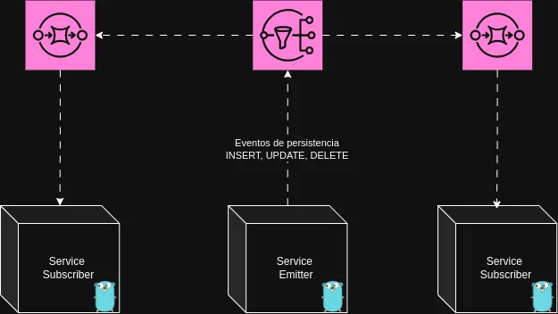

# Go GORM-SNS Eventer

Biblioteca em Go para escutar eventos de persistência do GORM e disparar mensagens via AWS SNS. Microserviços interessados podem criar subscriptions SQS para receber esses eventos e manter seus dados sincronizados.

---

## Sumário

- [Descrição](#descrição)
- [Fluxograma](#fluxograma)
- [Instalação](#instalação)
- [Pré-requisitos AWS](#pré-requisitos-aws)
- [Configuração e Uso](#configuração-e-uso)
    - [1. Inicialização](#1-inicialização)
    - [2. Definição de Entidades e DTOs](#2-definição-de-entidades-e-dtos)

---

## Descrição

Este pacote oferece:

- Interceptação de operações CRUD no GORM (Create, Update, Delete).
- Conversão da entidade para um DTO genérico.
- Publicação automática via AWS SNS em um tópico configurado.
- Microserviços consumidores devem criar uma subscription SQS no mesmo tópico para receber os eventos.

---

## Fluxograma



---

## Instalação

```bash
go get -u  github.com/tecmise/asynchronous-event-channel-lib-go
```

## Pré-requisitos AWS

1) Tópico SNS criado.
2) Fila SQS criada.
3) Subscription SNS → SQS configurada.
4) **IAM** Policy que permita:
 - GORM (sua aplicação) publicar no SNS.
 - SNS enviar mensagens à SQS.

## Configuração e Uso

Existem duas formas de utilizar a biblioteca: com ou sem validação do DTO antes do envio. A validação é recomendada para garantir a integridade dos dados enviados.
Ao eventChannel adicionar channels, você pode optar por usar `WrapperChannelWithValidation` ou `WrapperChannel`, dependendo se deseja validação ou não.
Alem disso uma valida instancia do GORM deve ser passada para o método `RegistryEmit`.

Aqui usamos o pacote entity para separar nossas entidades, porem a abordagem nos protos seria diferente, usando pacotes como identificador do dto especifico e um objeto
Request como o emissor do evento.


1) Inicialização
```go

"github.com/tecmise/asynchronous-event-channel-lib-go/pkg/callback"

...


eventChannel := callback.NewAsyncChannel()

// Exemplo com validation
customerValidation := func(req YOUR_ENTITY.Request) error { return req.Validate() }

eventChannel.AddChannels(
callback.WrapperChannelWithValidation[entity.YOUR_ENTITY, YOUR_ENTITY.Request](emitter.NewSnsEmitter[YOUR_ENTITY.Request](client.SNS(), YOUR_SERVICE_NAME), customerValidation),
)


// Exemplo sem validation
eventChannel.AddChannels(
callback.WrapperChannel[entity.YOUR_ENTITY, YOUR_ENTITY.Request](emitter.NewSnsEmitter[YOUR_ENTITY.Request](client.SNS(), YOUR_SERVICE_NAME), customerValidation),
)


channelEmitError := eventChannel.RegistryEmit(DB)

if channelEmitError != nil {
logrus.Fatalf("failed to register event channel callbacks: %v", channelEmitError)
}

...
```

Client SNS

```go
func SNS() *sns.Client {
	if clientSns == nil {
		cfg, err := aws_config.LoadDefaultConfig(context.Background(), aws_config.WithRegion("us-east-1"))
		if err != nil {
			logrus.Panicf("Error creating AWS session: %v", err)
		}
		clientSns = sns.NewFromConfig(cfg)
	}
	return clientSns
}

```

2) Definição de Entidades e DTOs

A primeira variavel no arquivo de entidade define que a entidade MyEntity implementa a interface Emitable do pacote definition, 
com o DTO MY_PACKAGE_ENTITY_PROTO.Request como tipo genérico, ou seja essa entidade pode ser emitida como esse DTO.

O Metodo GetAsyncEmitterData converte a entidade MyEntity em um DTO MY_PACKAGE_ENTITY_PROTO.Request, que é o formato esperado para envio via SNS.

O Metodo GetFifoProperties define propriedades específicas para filas FIFO, como MessageGroupId e MessageDeduplicationId.

O Metodo Metadada fornece metadados sobre o evento, como o nome do tópico e o nome da entidade, o nome do topico `deve ser passado como uma variavel de ambiente`.

```go

var (
	_ definition.Emitable[MY_PACKAGE_ENTITY_PROTO.Request] = (*MyEntity)(nil)
)

// Customer representa a tabela s4s.customer
type MyEntity struct {
	ID                  uint64          `gorm:"primaryKey;autoIncrement" json:"id"`
	Name                string          `gorm:"type:text;not null" json:"name"`
}

func (c MyEntity) Validate(functions ...request.CustomValidator) error {
	validate := validator.New()
	return validate.Struct(c)
}

func (c MyEntity) GetFifoProperties() *properties.FifoProperties {
	return &properties.FifoProperties{
		MessageGroupId:         "customers",
		MessageDeduplicationId: fmt.Sprintf("%d", c.ID),
	}
}

func (c MyEntity) Metadada() definition.EmitableMetadata {
	return definition.EmitableMetadata{
		Publisher: VAR_TOPIC_NAME,
		Name:      "MyEntity",
	}
}

// Parser
func (c MyEntity) GetAsyncEmitterData() (*MY_PACKAGE_ENTITY_PROTO.Request, error) {
	return &MY_PACKAGE_ENTITY_PROTO.Request{
		Id:                  c.ID,
		Name:                c.Name,
		DocumentType:        c.DocumentType,
		ContractDescription: c.ContractDescription,
		Document:            c.Document,
	}, nil
}

func (MyEntity) TableName() string {
	return "my_table"
}
```
